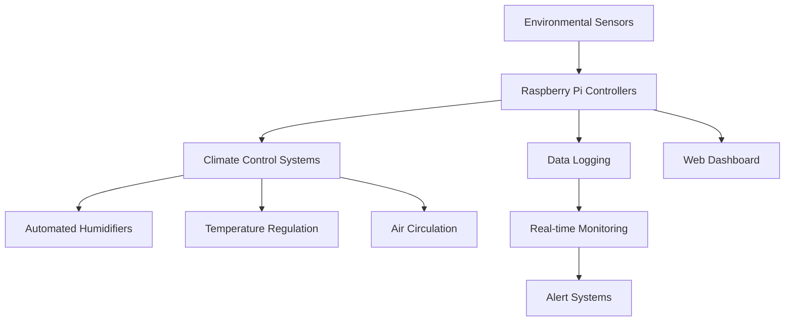

# 🍄 HappyCaps Mushroom Farm Ltd.
### *Where Fungi Meets Technology*

---

## 🌱 **About HappyCaps**

**HappyCaps** is a cutting-edge urban mushroom farm based in **Gloucestershire, UK**, where traditional mycology meets modern technology. Founded in 2023 by Aaron Jacobs, we're revolutionizing small-scale mushroom cultivation through innovative automation, comprehensive documentation, and open-source tools.

### 🎯 **Our Mission**
*Democratizing mushroom cultivation through technology, education, and community collaboration*

### 🧬 **What Makes Us Different**
- **Tech-Driven Cultivation**: Raspberry Pi monitoring systems, automated climate control, and precision environmental management
- **Open Source Philosophy**: All our tools, guides, and automation code are freely available
- **Educational Focus**: Comprehensive documentation and classroom-ready educational kits
- **Sustainable Practices**: Low-impact growing methods with maximum yield efficiency

---

## 🚀 **Our GitHub Universe**

### 📊 **Live Public Repository Stats**

| Repository | Description | Language | Status |
|------------|-------------|----------|--------|
| **[classroom-grow-kit](https://github.com/happycaps-uk/classroom-grow-kit)** | 📚 Educational materials and documentation for school mushroom growing programs |  | ✅ Active |
| **[grow-kit-docs](https://github.com/happycaps-uk/grow-kit-docs)** | 📖 Complete care instructions and troubleshooting guides for all grow kit varieties |  | ✅ Active |
| **[.github](https://github.com/happycaps-uk/.github)** | 🏠 Organization profile and community templates |  | ✅ Active |

### 🔬 **Tech Stack Highlights**

---

## 🍄 **Our Products & Innovation**

### 🌟 **Mushroom Varieties We Cultivate**

<table>
<tr>
<td align="center">
<h4>🦪 Oyster Mushrooms</h4>
<em>Pleurotus ostreatus</em> 
</td>
<td align="center">
<h4>🦁 Lion's Mane</h4>
<em>Hericium erinaceus</em> 
</td>
<td align="center">
<h4>👑 King Oyster</h4>
<em>Pleurotus eryngii</em> 
</td>
</tr>
<tr>
<td align="center">
<h4>🍄 Shiitake</h4>
<em>Lentinula edodes</em> 
</td>
<td align="center">
<h4>🍷 Wine Cap</h4>
<em>Stropharia rugosoannulata</em> 
</td>
<td align="center">
<h4>🐛 Cordyceps</h4>
<em>Cordyceps militaris</em> 
</td>
</tr>
</table>

### 🎓 **Educational Impact**
- **Classroom Grow Kits**: Specially designed for schools with complete lesson plans
- **Educational Workshops**: Hands-on mycology sessions

---

## 🔧 **Technology & Automation**

### 🏗️ **Our Smart Farm Infrastructure**

### 📡 **Monitoring Systems**
- **Aranet4 Pro** sensors for temperature, humidity, CO₂, and atmospheric pressure
- **Inkbird ICC-800** climate controllers with 8-channel monitoring
- **Custom Raspberry Pi** setups for data logging and automated responses
- **Real-time alerts** for parameter deviations

### 🛠️ **Key Equipment**
- **Brune B500 & B250** ultrasonic humidifiers
- **All American 941** pressure sterilizer (41.5 quarts)
- **Custom-built laminar flow hood** with HEPA H14 filtration
- **Automated substrate mixer** (50kg capacity)
- **Commercial-grade refrigeration** with precise temperature control

---

## 📚 **Documentation Excellence**

### 🎯 **Our Obsidian Knowledge Vault**

We maintain a comprehensive, version-controlled knowledge base covering:

- **🔬 Cultivation Guides**: Species-specific growing parameters and techniques
- **📋 Standard Operating Procedures**: HACCP-compliant safety protocols
- **🎓 Training Materials**: Employee onboarding and skill development
- **📊 Data Analysis**: Growth rate studies and performance metrics
- **🔧 Equipment Maintenance**: Detailed maintenance schedules and procedures

### 📈 **Quality Standards**
- **ISO-style documentation** with consistent formatting
- **Automated Git workflows** for version control
- **AI-assisted content generation** with standardized templates
- **Regular review cycles** ensuring accuracy and relevance

---

## 🤝 **Community & Collaboration**

### 🌍 **Open Source Contributions**

**We believe in sharing knowledge freely.** All our technology projects  include:
- ✅ Detailed setup instructions
- ✅ Complete hardware schematics
- ✅ Troubleshooting guides
- ✅ Community contribution guidelines

### 🎯 **Looking for Contributors**

Join our growing community if you're interested in:
- **🔬 Mycology Research**: Strain development and optimization
- **💻 IoT Development**: Sensor integration and automation
- **📝 Technical Writing**: Documentation and educational content
- **🎨 Design**: UI/UX for monitoring dashboards
- **🧪 Data Science**: Analysis of cultivation metrics

### 🤔 **How to Get Involved**

1. **🍴 Fork** any repository that interests you
2. **📖 Read** our contribution guidelines
3. **💬 Open an issue** for questions or suggestions
4. **🚀 Submit a PR** with your improvements

---

## 📊 **Current Stats & Achievements**

| Metric | Value |
|--------|-------|
| **Years Operating** | 2+ |
| **Mushroom Varieties** | 6+ |
| **Grow Kits Distributed** | 500+ |
| **Educational Workshops** | 5+ |
| **GitHub Repositories** | 3 and growing|
| **Documentation Pages** | 100+ |

---

## 🔮 **What's Next?**

### 🚀 **Upcoming Projects**
- **🌐 IoT Integration**: Cloud-based dashboard for remote monitoring
- **🧬 Strain Database**: Comprehensive genetic and performance tracking
- **🎓 Online Learning Platform**: Interactive cultivation courses

### 💡 **Research Areas**
- **🍄 Novel Strain Development**: Optimizing yields and resistance
- **♻️ Waste Stream Utilization**: Converting agricultural waste to substrates
- **🌡️ Climate Optimization**: AI-driven environmental control
- **📈 Predictive Analytics**: Forecasting yields and identifying issues

---

## 📞 **Get in Touch**

**Ready to join the mycelium network?**

📧 **Business Inquiries**: aaron@happycaps.co.uk  
🔧 **Technical Questions**: aaron@happycaps.co.uk  
📱 **Social Media**: [@happycapsmushroomfarm](https://instagram.com/happycapsmushroomfarm)  
🌐 **Website**: [happycaps.co.uk](https://happycaps.co.uk)  
📍 **Location**: Gloucestershire, UK  

---

**"Growing mushrooms, growing code, growing communities."**

*— The HappyCaps Team*

